# 🛒 Shopping Cart Backend API

A RESTful API for managing a shopping cart system, built with **NestJS**, **MongoDB**, and following **Layered Architecture with Clean Architecture principles**.

---

## 📑 Table of Contents

- [✨ Description](#-description)
- [🏗️ Architecture](#️-architecture)
  - [Project Structure](#project-structure)
  - [High-Level Architecture Diagram](#high-level-architecture-diagram)
  - [Sequence Diagrams](#sequence-diagrams)
- [🧰 Tech Stack](#-tech-stack)
- [⚙️ Prerequisites](#️-prerequisites)
- [🚀 Installation & Setup](#-installation--setup)
  - [🐳 Docker](#-docker)
  - [💻 Local Development](#-local-development)
- [📝 API Endpoints](#-api-endpoints)
  - [Examples with `curl`](#examples-with-curl)
- [🔧 Environment Variables](#-environment-variables)
- [🌱 Database Seeding](#-database-seeding)
- [🛠️ Technical Decisions](#️-technical-decisions)
- [📚 Business Rules](#-business-rules)
- [🎯 API Best Practices](#-api-best-practices)
- [👨‍💻 Author](#-author)
- [📄 License](#-license)

---

## ✨ Description

This backend API implements a complete shopping cart system with the following features:

**Items Management:**

- List available items (Products and Events)
- Get item details by ID
- Automatic stock management

**Shopping Cart:**

- Add items to cart with stock validation
- Update item quantities
- Remove items from cart
- Clear entire cart
- Get cart summary with totals

The system implements **strict stock control** to prevent overselling and handles two types of items: **Products** (physical goods like sunglasses) and **Events** (tickets like concerts).

---

## 🏗️ Architecture

### Project Structure

```
src/
├── config/                    # Application configuration
│   ├── database.config.ts
│   ├── app.config.ts
│   └── validation.schema.ts
│
├── modules/
│   ├── items/                 # Items module
│   │   ├── domain/            # Business entities
│   │   │   ├── entities/
│   │   │   │   ├── item.entity.ts
│   │   │   │   ├── product.entity.ts
│   │   │   │   └── event.entity.ts
│   │   │   └── enums/
│   │   │       └── item-type.enum.ts
│   │   ├── application/       # Use cases & DTOs
│   │   │   ├── dtos/
│   │   │   └── use-cases/
│   │   ├── infrastructure/    # Data access
│   │   │   ├── schemas/
│   │   │   └── repositories/
│   │   ├── presentation/      # HTTP layer
│   │   │   └── items.controller.ts
│   │   ├── items.service.ts
│   │   └── items.module.ts
│   │
│   └── cart/                  # Cart module (core functionality)
│       ├── domain/
│       │   ├── entities/
│       │   │   ├── cart.entity.ts
│       │   │   └── cart-item.entity.ts
│       │   └── value-objects/
│       │       └── cart-summary.vo.ts
│       ├── application/
│       │   ├── dtos/
│       │   └── use-cases/
│       ├── infrastructure/
│       │   ├── schemas/
│       │   └── repositories/
│       ├── presentation/
│       │   └── cart.controller.ts
│       ├── cart.service.ts
│       └── cart.module.ts
│
├── database/
│   └── seeders/
│       └── seed-items.ts      # Test data seeder
│
├── main.ts                    # Bootstrap + Swagger + Session
└── app.module.ts              # Root module
```

### High-Level Architecture Diagram

#### Layered Architecture with Clean Principles


---

### Sequence Diagrams

#### 📦 Add Item to Cart

```mermaid
sequenceDiagram
    autonumber
    participant Client as 📱 Client
    participant Controller as 🎯 CartController
    participant Service as ⚙️ CartService
    participant UseCase as 📋 AddItemToCartUseCase
    participant ItemRepo as 🗄️ ItemRepository
    participant CartRepo as 🗄️ CartRepository
    participant DB as 🍃 MongoDB

    Client->>Controller: POST /cart/items<br/>{itemId, quantity}
    Controller->>Service: addItem(sessionId, dto)
    Service->>UseCase: execute(sessionId, dto)

    Note over UseCase,ItemRepo: Validate item exists
    UseCase->>ItemRepo: findById(itemId)
    ItemRepo->>DB: items.findById()

    alt ❌ Item not found
        DB-->>ItemRepo: null
        ItemRepo-->>UseCase: null
        UseCase-->>Service: BadRequestException
        Service-->>Controller: Exception
        Controller-->>Client: 400 Bad Request
    else ✅ Item found
        DB-->>ItemRepo: Item document
        ItemRepo-->>UseCase: Item entity

        Note over UseCase: Check stock availability
        UseCase->>UseCase: item.hasStock(quantity)

        alt ❌ Insufficient stock
            UseCase-->>Service: BadRequestException<br/>"Insufficient stock"
            Service-->>Controller: Exception
            Controller-->>Client: 400 Bad Request
        else ✅ Stock available
            UseCase->>CartRepo: findBySessionId(sessionId)
            CartRepo->>DB: carts.findOne({sessionId})

            alt Cart doesn't exist
                DB-->>CartRepo: null
                CartRepo-->>UseCase: null
                UseCase->>UseCase: Create new Cart
            else Cart exists
                DB-->>CartRepo: Cart document
                CartRepo-->>UseCase: Cart entity
            end

            UseCase->>UseCase: cart.addItem(cartItem)
            UseCase->>CartRepo: save(cart)
            CartRepo->>DB: carts.create() or update()
            DB-->>CartRepo: Saved cart
            CartRepo-->>UseCase: Cart entity
            UseCase-->>Service: Cart entity
            Service-->>Controller: Cart entity
            Controller-->>Client: 201 Created<br/>CartResponseDto
        end
    end
```



---

#### 🔄 Update Item Quantity

```mermaid
sequenceDiagram
    autonumber
    participant Client as 📱 Client
    participant Controller as 🎯 CartController
    participant Service as ⚙️ CartService
    participant UseCase as 📋 UpdateQuantityUseCase
    participant ItemRepo as 🗄️ ItemRepository
    participant CartRepo as 🗄️ CartRepository
    participant DB as 🍃 MongoDB

    Client->>Controller: PATCH /cart/items/:itemId<br/>{quantity}
    Controller->>Service: updateItemQuantity(sessionId, itemId, dto)
    Service->>UseCase: execute(sessionId, itemId, dto)

    UseCase->>CartRepo: findBySessionId(sessionId)
    CartRepo->>DB: carts.findOne({sessionId})

    alt ❌ Cart not found
        DB-->>CartRepo: null
        CartRepo-->>UseCase: null
        UseCase-->>Service: NotFoundException
        Service-->>Controller: Exception
        Controller-->>Client: 404 Not Found
    else ✅ Cart found
        DB-->>CartRepo: Cart document
        CartRepo-->>UseCase: Cart entity

        UseCase->>UseCase: cart.findItemByItemId(itemId)

        alt ❌ Item not in cart
            UseCase-->>Service: NotFoundException<br/>"Item not in cart"
            Service-->>Controller: Exception
            Controller-->>Client: 404 Not Found
        else ✅ Item in cart
            alt quantity > 0
                UseCase->>ItemRepo: findById(itemId)
                ItemRepo->>DB: items.findById()
                DB-->>ItemRepo: Item document
                ItemRepo-->>UseCase: Item entity

                UseCase->>UseCase: item.hasStock(quantity)

                alt ❌ Insufficient stock
                    UseCase-->>Service: BadRequestException
                    Service-->>Controller: Exception
                    Controller-->>Client: 400 Bad Request
                else ✅ Stock available
                    UseCase->>UseCase: cart.updateItemQuantity(itemId, quantity)
                    UseCase->>CartRepo: update(cart)
                    CartRepo->>DB: carts.updateOne()
                    DB-->>CartRepo: Updated cart
                    CartRepo-->>UseCase: Cart entity
                    UseCase-->>Service: Cart entity
                    Service-->>Controller: Cart entity
                    Controller-->>Client: 200 OK<br/>CartResponseDto
                end
            else quantity = 0
                Note over UseCase: Remove item when quantity is 0
                UseCase->>UseCase: cart.removeItem(itemId)
                UseCase->>CartRepo: update(cart)
                CartRepo->>DB: carts.updateOne()
                DB-->>CartRepo: Updated cart
                CartRepo-->>UseCase: Cart entity
                UseCase-->>Service: Cart entity
                Service-->>Controller: Cart entity
                Controller-->>Client: 200 OK<br/>CartResponseDto
            end
        end
    end
```



---

#### 🗑️ Remove Item from Cart

```mermaid
sequenceDiagram
    autonumber
    participant Client as 📱 Client
    participant Controller as 🎯 CartController
    participant Service as ⚙️ CartService
    participant UseCase as 📋 RemoveItemUseCase
    participant CartRepo as 🗄️ CartRepository
    participant DB as 🍃 MongoDB

    Client->>Controller: DELETE /cart/items/:itemId
    Controller->>Service: removeItem(sessionId, itemId)
    Service->>UseCase: execute(sessionId, itemId)

    UseCase->>CartRepo: findBySessionId(sessionId)
    CartRepo->>DB: carts.findOne({sessionId})

    alt ❌ Cart not found
        DB-->>CartRepo: null
        CartRepo-->>UseCase: null
        UseCase-->>Service: NotFoundException
        Service-->>Controller: Exception
        Controller-->>Client: 404 Not Found
    else ✅ Cart found
        DB-->>CartRepo: Cart document
        CartRepo-->>UseCase: Cart entity

        UseCase->>UseCase: cart.removeItem(itemId)

        alt ❌ Item not in cart
            UseCase-->>Service: Error<br/>"Item not found in cart"
            Service-->>Controller: Exception
            Controller-->>Client: 404 Not Found
        else ✅ Item removed
            UseCase->>CartRepo: update(cart)
            CartRepo->>DB: carts.updateOne()
            DB-->>CartRepo: Updated cart
            CartRepo-->>UseCase: Cart entity
            UseCase-->>Service: Cart entity
            Service-->>Controller: Cart entity
            Controller-->>Client: 200 OK<br/>CartResponseDto
        end
    end
```



---

#### 📊 Get Cart Summary

```mermaid
sequenceDiagram
    autonumber
    participant Client as 📱 Client
    participant Controller as 🎯 CartController
    participant Service as ⚙️ CartService
    participant UseCase as 📋 GetCartUseCase
    participant CartRepo as 🗄️ CartRepository
    participant DB as 🍃 MongoDB

    Client->>Controller: GET /cart
    Controller->>Service: getCart(sessionId)
    Service->>UseCase: execute(sessionId)

    UseCase->>CartRepo: findBySessionId(sessionId)
    CartRepo->>DB: carts.findOne({sessionId})

    alt Cart doesn't exist
        DB-->>CartRepo: null
        CartRepo-->>UseCase: null
        UseCase->>UseCase: Create empty cart
        UseCase-->>Service: Empty Cart entity
    else Cart exists
        DB-->>CartRepo: Cart document
        CartRepo-->>UseCase: Cart entity
        UseCase-->>Service: Cart entity
    end

    Service->>Service: cart.getSummary()
    Service-->>Controller: CartSummary
    Controller-->>Client: 200 OK<br/>CartResponseDto with totals
```



---

## 🧰 Tech Stack

| Category           | Technology                          | Version |
| ------------------ | ----------------------------------- | ------- |
| Runtime            | Node.js                             | v20     |
| Framework          | NestJS                              | Latest  |
| Language           | TypeScript                          | Latest  |
| Database           | MongoDB                             | Latest  |
| ODM                | Mongoose                            | Latest  |
| Validation         | class-validator & class-transformer | Latest  |
| Documentation      | Swagger/OpenAPI                     | Latest  |
| Session Management | express-session                     | Latest  |
| UUID Generation    | uuid                                | Latest  |

---

## ⚙️ Prerequisites

- Node.js v20+
- MongoDB (local or Atlas)
- Docker & Docker Compose (optional)
- npm or yarn

---

## 🚀 Installation & Setup

### 💻 Local Development

1. **Clone the repository:**

```bash
git clone <repository-url>
cd backend
```

2. **Install dependencies:**

```bash
npm install
```

3. **Create your `.env` file:**

```bash
cp .env.example .env
```

4. **Configure environment variables in `.env`:**

```env
NODE_ENV=development
PORT=3001
API_PREFIX=api/v1

MONGODB_URI=mongodb://localhost:27017/shopping_cart
MONGODB_URI_TEST=mongodb://localhost:27017/shopping_cart_test

CORS_ORIGIN=http://localhost:3000
SWAGGER_ENABLED=true

SESSION_SECRET=your-super-secret-key-change-in-production
```

5. **Seed the database with test data:**

```bash
npm run seed
```

6. **Start the development server:**

```bash
npm run start:dev
```

7. **Access the API:**
   - API: `http://localhost:3001/api/v1`
   - Swagger Documentation: `http://localhost:3001/api/docs`

---

### 🐳 Docker

**Recommended for full-stack deployment**

1. **Make sure you have the complete monorepo structure:**

```
shopping-cart-fullstack/
├── backend/
├── frontend/
└── docker-compose.yml
```

2. **Start all services:**

```bash
docker-compose up --build
```

This will start:

- MongoDB on port `27017`
- Backend API on port `3001`
- Frontend on port `3000`

3. **Access services:**
   - Backend API: `http://localhost:3001/api/v1`
   - API Docs: `http://localhost:3001/api/docs`
   - Frontend: `http://localhost:3000`

---

## 📝 API Endpoints

### Items Endpoints

| Method | Endpoint            | Description              | Status Codes           |
| ------ | ------------------- | ------------------------ | ---------------------- |
| GET    | `/api/v1/items`     | List all available items | 200 OK                 |
| GET    | `/api/v1/items/:id` | Get item details by ID   | 200 OK / 404 Not Found |

### Cart Endpoints

| Method | Endpoint                     | Description           | Status Codes                             |
| ------ | ---------------------------- | --------------------- | ---------------------------------------- |
| GET    | `/api/v1/cart`               | Get current cart      | 200 OK                                   |
| GET    | `/api/v1/cart/summary`       | Get cart summary      | 200 OK                                   |
| POST   | `/api/v1/cart/items`         | Add item to cart      | 201 Created / 400 Bad Request            |
| PATCH  | `/api/v1/cart/items/:itemId` | Update item quantity  | 200 OK / 400 Bad Request / 404 Not Found |
| DELETE | `/api/v1/cart/items/:itemId` | Remove item from cart | 200 OK / 404 Not Found                   |
| DELETE | `/api/v1/cart`               | Clear cart            | 204 No Content / 404 Not Found           |

---

### Examples with `curl`

#### Get all items

```bash
curl -X GET http://localhost:3001/api/v1/items \
  -H "Accept: application/json"
```

#### Get specific item

```bash
curl -X GET http://localhost:3001/api/v1/items/<ITEM_ID> \
  -H "Accept: application/json"
```

#### Add item to cart

```bash
curl -c cookies.txt -X POST http://localhost:3001/api/v1/cart/items \
  -H "Content-Type: application/json" \
  -d '{
    "itemId": "67230f4e8c9a1b2c3d4e5f6g",
    "quantity": 3
  }'
```

#### Get cart

```bash
curl -b cookies.txt -X GET http://localhost:3001/api/v1/cart \
  -H "Accept: application/json"
```

#### Update item quantity

```bash
curl -b cookies.txt -X PATCH http://localhost:3001/api/v1/cart/items/<ITEM_ID> \
  -H "Content-Type: application/json" \
  -d '{
    "quantity": 5
  }'
```

#### Remove item from cart

```bash
curl -b cookies.txt -X DELETE http://localhost:3001/api/v1/cart/items/<ITEM_ID>
```

#### Clear cart

```bash
curl -b cookies.txt -X DELETE http://localhost:3001/api/v1/cart
```

---

## 🔧 Environment Variables

| Variable           | Required | Default                    | Description               |
| ------------------ | -------- | -------------------------- | ------------------------- |
| `NODE_ENV`         | No       | `development`              | Environment mode          |
| `PORT`             | No       | `3001`                     | Server port               |
| `API_PREFIX`       | No       | `api/v1`                   | API route prefix          |
| `MONGODB_URI`      | **Yes**  | -                          | MongoDB connection string |
| `MONGODB_URI_TEST` | No       | -                          | Test database connection  |
| `CORS_ORIGIN`      | No       | `http://localhost:3000`    | Allowed CORS origin       |
| `SWAGGER_ENABLED`  | No       | `true`                     | Enable API documentation  |
| `SESSION_SECRET`   | No       | `shopping-cart-secret-key` | Session encryption secret |

---

## 🌱 Database Seeding

The project includes a seed script to populate the database with test data matching the technical test requirements.

**Run the seeder:**

```bash
npm run seed
```

**Seeded items:**

- **Products:**
  - Sunglasses Carey - €39.99
  - Classic White T-Shirt - €19.99

- **Events:**
  - Red Hot Chili Peppers in Madrid - €60.00
  - Barcelona Jazz Festival - €45.00

---

## 🛠️ Technical Decisions

### 🏛️ Architecture Patterns

- **Layered Architecture**: Clear separation between Presentation, Application, Domain, and Infrastructure
- **Clean Architecture Principles**: Dependencies point inward toward the domain
- **Domain-Driven Design**: Rich domain entities with business logic
- **Repository Pattern**: Data access abstraction
- **Use Case Pattern**: Single-responsibility business operations

### 🔗 Key Design Decisions

#### 1. **Session-Based Carts**

- Uses `express-session` for anonymous cart management
- Session ID automatically generated for new users
- Persists across requests via cookies
- Ready to migrate to user-based carts with authentication

#### 2. **Stock Control**

- Validation at use case level before any database operation
- Prevents overselling by checking available stock
- Clear error messages showing available vs requested quantity
- Checks both when adding and updating quantities

#### 3. **Item Type Discrimination**

- Single collection for both Products and Events
- Type field differentiates between item types
- Shared attributes (name, price, stock) in base entity
- Type-specific attributes in specialized entities

#### 4. **Business Logic Location**

- **Domain Entities**: Core business rules (quantity validation, subtotal calculation)
- **Use Cases**: Orchestration and coordination between repositories
- **Services**: High-level operations combining multiple use cases

#### 5. **Error Handling**

- Domain exceptions for business rule violations
- HTTP exceptions at controller level
- Clear, actionable error messages
- Proper HTTP status codes (400, 404, 409, 500)

---

## 📚 Business Rules

### Cart Operations

1. **Adding Items:**
   - ✅ Item must exist in the database
   - ✅ Item must have sufficient stock
   - ✅ If item already in cart, quantity is increased
   - ✅ New cart is created automatically for new sessions

2. **Updating Quantities:**
   - ✅ Quantity must be >= 0
   - ✅ Quantity of 0 removes the item
   - ✅ New quantity must not exceed available stock
   - ✅ Item must be in the cart

3. **Removing Items:**
   - ✅ Item must be in the cart
   - ✅ Cart is updated but not deleted

4. **Stock Validation:**
   - ✅ Prevents adding items without stock
   - ✅ Considers items already in cart when validating
   - ✅ Shows available stock in error messages

---

## 🎯 API Best Practices

- ✅ **RESTful Design**: Resource-based URLs, proper HTTP methods
- ✅ **Input Validation**: DTOs with class-validator decorators
- ✅ **Output Transformation**: Consistent response formats
- ✅ **CORS Enabled**: Configured for frontend integration
- ✅ **Session Management**: Stateful cart sessions
- ✅ **Swagger Documentation**: Interactive API documentation
- ✅ **Error Handling**: Consistent error response format
- ✅ **HTTP Status Codes**: Semantic and correct usage

---

## 📖 API Documentation

Once the server is running, access the interactive Swagger documentation:

**URL:** `http://localhost:3001/api/docs`

The Swagger UI provides:

- Complete API reference
- Request/response schemas
- Try-it-out functionality
- Example payloads

---

## 🧪 Testing

```bash
# Run unit tests
npm test

# Run tests in watch mode
npm run test:watch

# Run tests with coverage
npm run test:cov

# Run e2e tests
npm run test:e2e
```

---

## 📦 Project Scripts

```bash
# Development
npm run start:dev      # Start with hot-reload
npm run start:debug    # Start with debugger

# Production
npm run build          # Build the project
npm run start:prod     # Start production server

# Database
npm run seed           # Populate database with test data

# Code Quality
npm run lint           # Lint code
npm run format         # Format code with Prettier

# Testing
npm test               # Run tests
npm run test:cov       # Test coverage
npm run test:e2e       # End-to-end tests
```

---

## 🎓 Learning Resources

This project demonstrates:

- ✅ Clean Architecture implementation in NestJS
- ✅ Domain-Driven Design principles
- ✅ Layered architecture pattern
- ✅ MongoDB with Mongoose ODM
- ✅ Session management
- ✅ Input validation and transformation
- ✅ Error handling strategies
- ✅ API documentation with Swagger

---

## 👨‍💻 Author

**Your Name** - _Fullstack Developer_

- LinkedIn: [Your Profile](https://linkedin.com/in/yourprofile)
- Email: your.email@example.com
- GitHub: [@yourusername](https://github.com/yourusername)

---

## 📄 License

This project is licensed under the MIT License - see the [LICENSE](LICENSE) file for details.

---

## 🙏 Acknowledgments

Built as part of a technical assessment demonstrating:

- Modern backend architecture
- Clean code principles
- RESTful API design
- MongoDB/Mongoose proficiency
- NestJS framework mastery

---

⭐️ **If you find this project useful, don't forget to give it a star on GitHub!** ⭐️
